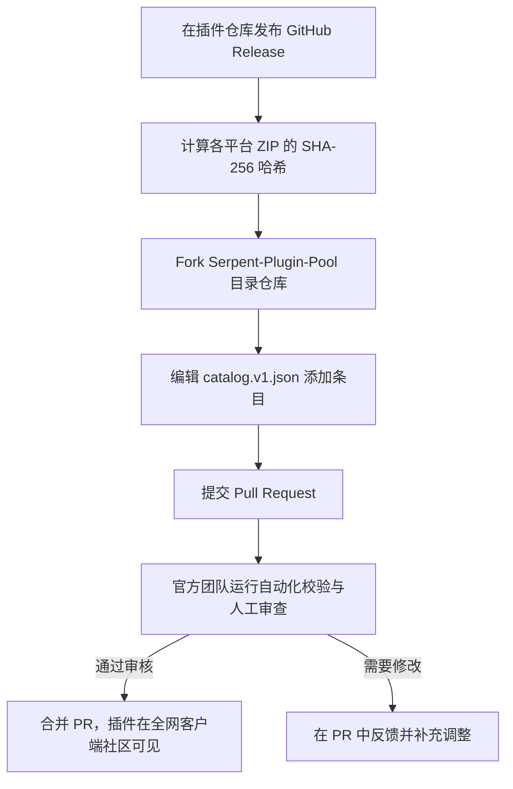

# 插件分发、Release 命名与更新策略

> 状态：产品规范（2026-09-06）  
> 安装通道：**官方插件社区** · **GitHub（高级）** · **本地 ZIP** · **本地文件夹**  
> 实现跟踪：`Serpent-u3nx`（Release asset + 平台匹配）、`Serpent-8r91`（更新提示与自动更新）  
> 官方目录：https://github.com/dolag233/Serpent-Plugin-Pool

> 相关：[插件开发手册](development.md)、[插件开发最佳实践](best-practices.md)、[0024](https://github.com/dolag233/Serpent/blob/dev/docs/internal/implementation/0024-script-plugin-platform.md)、[ADR-0026](https://github.com/dolag233/Serpent/blob/dev/docs/internal/adr/0026-plugin-runtime-installation-and-trust.md)

## 1. 安装通道（产品面）

| 通道 | 用户操作 | Serpent 行为 |
| --- | --- | --- |
| **插件社区** | 设置 → 插件 → 打开插件社区，选官方/已认证插件安装 | Main 拉 GitHub raw `catalog.v1.json`，按条目钉死的 Release ZIP + sha256 安装；**禁止 zipball** |
| **本地文件夹** | 高级安装：选择已构建的插件目录 | 校验清单与 `runtime.entry` 后拷贝进安装根 |
| **本地 ZIP** | 高级安装：选择符合规范的 `.zip` | 解压后同上校验 |
| **GitHub** | 高级安装：粘贴 `https://github.com/owner/repo` 或 Release 页 URL | **优先**取匹配当前平台的 **Release asset ZIP**；没有规范 asset 时才回退源码 zipball（仅此高级通道） |

Serpent **不预装**任何插件。社区目录失败时使用上次缓存，并标明「未更新」。

认证 ≠ 信任：无限制插件仍走 ADR-0026 确认。社区安装钉死 `releaseTag` / `fileName` / `sha256`，不跟随 GitHub 最新 Release 自动更新。

三条成品包装入后的包形态必须相同：**成品包**（见 §3），不是未构建源码树。

本地「源码目录 + 现场 npm」**不做**：用户路径仅为成品包通道。

### 1.1 设置页安装流程

设置 → 插件：

- **打开插件社区**：滑入整页目录（搜索、官方 badge、安装范围、返回）。点卡片进入详情：作者、版本、仓库、运行模式、平台和简介在前，README 在后。
- **高级安装**：本地文件夹/ZIP，或粘贴 GitHub URL（可 zipball 回退）。

用户侧步骤与截图见 [插件使用](../../user-guide/plugins.md)。


社区通道下载失败、哈希不符、没有当前平台包或插件包校验失败时，保留可读失败原因；不会把本机绝对路径显示给 Renderer。

自动更新是「设置 → 插件」总览区的设备级开关，只作用于**非社区钉死**的 GitHub 插件。社区插件的新版本必须先改目录仓条目并合并。

### 1.2 安装目录与版本替换

每个安装范围内，一个插件 ID 只有一个活动目录：

```text
userData/plugins/<pluginId>/
{library}/.serpent/plugins/<pluginId>/
```

当前版本、来源和包哈希只记录在插件清单与对应 lock 文件中，不再使用
`<pluginId>/<version>/` 作为活动包路径。安装新版本时先完成 staging 与完整校验，再原子替换该插件 ID 的活动目录和 lock；失败时保留旧目录。

这意味着同一安装范围不保留多个可切换的本地版本，插件管理器的本地
`rollback` 在覆盖安装后会明确返回“没有上一份已安装包”。需要回退时，重新安装旧版本 ZIP/目录即可；如果当前设备的 Resolution 仍指向旧包哈希，Host 会要求用户显式选择新包，不会静默启用替换包。

## 2. 平台标识（判定与命名共用）

与 Electron / Node `process.platform` + `process.arch` 对齐（清单 `nativeModules` 已用同一套）：

| 规范 token | 含义 | Node 对应 |
| --- | --- | --- |
| `darwin-arm64` | macOS Apple Silicon | `darwin` + `arm64` |
| `darwin-x64` | macOS Intel | `darwin` + `x64` |
| `win32-x64` | Windows 64 位（常见） | `win32` + `x64` |
| `win32-arm64` | Windows on ARM | `win32` + `arm64` |
| `win32-ia32` | Windows 32 位（可选维护） | `win32` + `ia32` |
| `linux-x64` | Linux x86_64 | `linux` + `x64` |
| `linux-arm64` | Linux aarch64 | `linux` + `arm64` |
| `any` | 无原生二进制、全平台同一 ZIP | — |

口语文案映射（UI 可用，**文件名必须用规范 token**）：

| 口语文案 | 规范 token |
| --- | --- |
| Mac Apple Silicon / M 系列 | `darwin-arm64` |
| Mac Intel | `darwin-x64` |
| Windows x64 | `win32-x64` |
| Windows ARM | `win32-arm64` |
| Windows x86（32 位） | `win32-ia32` |

安装与更新时：先匹配 `platform-arch` 精确 asset；若无则尝试 `any`；再无则失败并提示缺少本平台包（不得静默下载错误架构）。

无限制插件若声明 `runtime.nativeModules`，还须与当前 `nodeAbi` 兼容（既有兼容性校验保留）。

## 3. 成品包内容（ZIP 内 / 文件夹内）

根目录（或 ZIP 解压后唯一顶层目录）须含：

```text
serpent-plugin.json
README.md
README.zh-CN.md          # 可选；社区详情中文优先
README.en.md             # 可选；社区详情英文优先
LICENSE
<entry 指向的已编译 JS>   # 如 entry/main.js 或 dist/main.js
[可选 ui/ 等清单声明文件]
[可选：已捆绑的 node_modules 或原生 .node，按平台 ZIP 分流]
```

禁止依赖用户机器现场执行 `npm install` / `npm run build` 才能通过校验。

社区详情页按应用语言，从**钉死的 Release tag** 拉取 README（走 `raw.githubusercontent.com`，禁止 zipball）：

- 中文：`README.zh-CN.md` → `README.zh.md` → `README.md`
- 英文：`README.en.md` → `README.md`

图片不会嵌进 Serpent 窗口；相对路径会变成可在浏览器打开的 GitHub 链接。目录可选 `author`；缺省时详情作者显示 GitHub owner。

### 3.1 ZIP 条目路径

Host 用 adm-zip **读取** ZIP，不在 Windows 上提供 `zip` 命令。条目名必须是相对 POSIX 路径：

- 使用 `/` 分隔目录，例如 `entry/main.js`。
- 不要使用 `\`、盘符、前导 `/`、`..`。
- 不要把当前目录写成路径段：`./serpent-plugin.json` 会被旧版 Host 拒绝（`PLUGIN_ARCHIVE_INVALID`：absolute or traversing path）。当前 Host 会去掉 `./` 并把 `\` 换成 `/`，但发布包仍应写出不含这些前缀的路径。
- 允许 ZIP 内有且仅有一层包裹目录（`my-plugin/serpent-plugin.json`）；解压后会剥掉该前缀。
- 禁止符号链接。

Windows 上 `tar -a -c -f out.zip -C dist .` 会稳定写出 `./` 前缀；`Compress-Archive` 可能写出反斜杠。不要依赖这两条命令直接作为 Release 产物。打包方式见 [最佳实践 §8](best-practices.md#8-成品包与-zip-条目名)。参考实现：纯 JS/通用包参考 [Serpent-Plugin-MediaConverter](https://github.com/dolag233/Serpent-Plugin-MediaConverter) 或 [Serpent-Plugin-Renamer](https://github.com/dolag233/Serpent-Plugin-Renamer)；平台原生二进制分流包参考 [Serpent-Plugin-ImageUpscaler](https://github.com/dolag233/Serpent-Plugin-ImageUpscaler)。

## 4. GitHub Release 结构与 asset 命名

### 4.1 Release

- 使用 **GitHub Release**（建议 tag = 清单 `version`，如 `1.2.0` 或 `v1.2.0`，安装器应接受可选 `v` 前缀）。
- 每个需要原生/平台分流的版本，为**每个支持的平台**上传一个 ZIP asset。
- 纯 JS、无原生依赖：可只上传一个 `…-any.zip`。

### 4.2 Asset 文件名（强制）

```text
{pluginId}-{version}-{platformToken}.zip
```

规则：

- `pluginId`：与清单 `id` 完全一致（小写、点分，如 `com.example.image-upscaler`）
- `version`：SemVer，**不含**前导 `v`（如 `1.2.0`）；Release tag 可为 `v1.2.0`
- `platformToken`：§2 规范 token（`darwin-arm64`、`win32-x64`、`any` 等）
- 仅允许字符：`[a-z0-9._-]`；整名大小写敏感，发布时用小写

示例：

```text
com.example.image-upscaler-1.2.0-darwin-arm64.zip
com.example.image-upscaler-1.2.0-darwin-x64.zip
com.example.image-upscaler-1.2.0-win32-x64.zip
com.example.image-upscaler-1.2.0-win32-arm64.zip
com.example.palette-tools-2.0.1-any.zip
```

推荐另附 `SHA256SUMS`（或每个 zip 旁 `.sha256`）；实现阶段可先做文件名匹配，哈希校验作为增强。

### 4.3 仓库 URL 解析优先级

用户粘贴 GitHub 相关 URL 时，建议顺序：

1. **Release / tag 页** → 解析 owner/repo + tag → 列 assets → 选平台 ZIP  
2. **仓库根 URL** → 取 **最新稳定 Release**（非 draft/prerelease，除非用户显式选预发布）→ 同上  
3. **兼容回退（过渡期）**：若 Release 无规范 asset，但 tag/默认分支 zipball 内已有成品包，可继续旧行为并提示作者迁移到 Release asset（过渡结束后可移除）

不默认执行：对源码归档跑 package manager。

## 5. 成为官方插件与官方认证插件

Serpent 内置的“插件社区”面向所有用户提供可发现、可一键安装的扩展中心。目录真相源托管在官方 GitHub 仓库 [Serpent-Plugin-Pool](https://github.com/dolag233/Serpent-Plugin-Pool)。

### 5.1 插件分类与认证层级

- **官方插件（Official Plugins）**：由 Serpent 核心团队直接开发、维护与发布的插件，在社区目录中标记有官方徽章。
- **官方认证插件（Verified Community Plugins）**：由第三方开源作者或社区团队开发，经过 Serpent 官方安全审查、包结构规范验证和功能可用性检验后，正式收录入官方目录的插件。
- **未认证插件 / 高级安装**：由用户直接通过本地 ZIP、本地目录或粘贴任意 GitHub URL 安装的插件。Serpent 允许用户自由安装，但在安装时会显示未认证警告。

### 5.2 认证插件准入标准

希望将插件收录进官方插件社区的开发者，其插件必须满足以下准入要求：

1. **完全开源**：插件源码必须公开发布于 GitHub 仓库，并使用宽松的开源许可证（如 MIT、Apache-2.0、BSD-3-Clause 等）。
2. **制品不可变性与规范命名**：必须使用 GitHub Release 分发成品包，Asset 文件名必须严格遵循 `{pluginId}-{version}-{platformToken}.zip` 规范（见 §4.2），且包内包含编译后的成品代码（严禁要求用户环境执行 `npm install` 或动态构建）。
3. **最小权限原则**：Manifest（`serpent-plugin.json`）中仅声明插件实现功能所必须的权限，不得申请无关权限。
4. **透明披露与沙箱安全**：
   - 优先推荐 `restricted` 受限模式；
   - 若使用 `unrestricted` 非受限模式，必须在 Manifest 及 README 中如实声明所有本地进程调用、网络请求目的、数据存储位置及原生模块依赖，严禁静默执行未经用户许可的外部行为；
   - 严禁包含任何恶意挖矿、私自收集并上传用户资产或元数据等侵犯隐私的代码。
5. **多语言文档与展示**：必须提供清晰的说明文档，推荐提供 `README.md`（英文）与 `README.zh-CN.md`（中文优先）；说明中应包含功能简介、配置参数说明及快捷操作。

### 5.3 申请收录流程（向 Serpent-Plugin-Pool 提交 PR）

收录为官方认证插件采用 GitHub Pull Request 的标准流程：



1. **发布 Release**：在你的插件 GitHub 仓库创建新 Release（例如 `v1.0.0`），上传所有支持平台的规范 ZIP 包。
2. **计算校验哈希**：计算每个上传的平台 ZIP 文件的 SHA-256 哈希值。
3. **编辑目录清单**：Fork 官方目录仓库 [dolag233/Serpent-Plugin-Pool](https://github.com/dolag233/Serpent-Plugin-Pool)，在 `catalog.v1.json` 的 `plugins` 列表中新增或更新你的插件条目：
   ```jsonc
   {
     "id": "com.example.my-plugin",
     "name": "My Plugin",
     "version": "1.0.0",
     "description": "Short description of my plugin.",
     "locales": {
       "zh-CN": {
         "name": "我的插件",
         "description": "我的插件简短中文说明。"
       }
     },
     "author": "Author Name",
     "repository": "https://github.com/author/my-plugin",
     "releaseTag": "v1.0.0",
     "runtime": {
       "mode": "restricted"
     },
     "assets": {
       "darwin-arm64": {
         "fileName": "com.example.my-plugin-1.0.0-darwin-arm64.zip",
         "sha256": "abcdef123456...<64位完整哈希>"
       },
       "win32-x64": {
         "fileName": "com.example.my-plugin-1.0.0-win32-x64.zip",
         "sha256": "123456abcdef...<64位完整哈希>"
       }
     }
   }
   ```
4. **发起 Pull Request**：向 `Serpent-Plugin-Pool` 的 `main` 分支发起 PR。在 PR 描述中简要说明插件用途，并附上功能测试证据。
5. **审查与合并**：
   - 官方自动化流程会校验 ZIP 下载地址可用性、SHA-256 校验和以及 Manifest 静态 schema 合法性；
   - 核心维护者对代码及权限进行安全性审查；
   - 审核通过并合并后，客户端打开「插件社区」即可即时检索并安装该插件。

### 5.4 版本更新与维护

- 社区目录采用**不可变哈希钉死**机制，客户端不会自动静默拉取插件作者 GitHub 上的最新 Release；
- 当你的插件发布新版本时，需重复上述流程，向 `Serpent-Plugin-Pool` 发起修改 `catalog.v1.json` 中 `version`、`releaseTag` 与对应 `sha256` 的 PR；
- PR 合并后，已安装该插件的用户在「设置 → 插件」中会收到“有可用更新”提示，点击即可完成更新。

### 5.5 下架与违规撤回政策（Revocation）

为保护所有最终用户的资产与设备安全，若已收录的认证插件出现以下情况，Serpent 团队保留立即下架的权利：
- 发现存在未披露的安全漏洞、高危网络外联行为或恶意代码；
- 插件依赖的外部服务失效且作者长期未维护修复；
- 收到知识产权或开源许可侵权投诉并经核实。

下架后，该插件将不再出现在社区目录中，严重安全事件会通过安全通报提醒用户停用或卸载。

## 6. 更新显示与自动更新

仅对 **来源为 GitHub** 且能解析到规范 Release asset 的安装生效。本地文件夹 / 本地 ZIP 不自动检查远端（用户可重新选择文件覆盖安装）。

### 6.1 显示更新

设置 → 插件列表中，对 GitHub 安装的包：

- 定期或打开设置时检查：是否存在更高 SemVer 的 Release，且含当前平台（或 `any`）asset  
- 若有：显示「有可用更新：{newVersion}」与「更新」按钮  
- 更新前复用既有 **来源/权限/运行时模式变更** 确认；包哈希变化时资源库插件需按信任规则处理

### 6.2 自动更新（可选勾选）

- 默认：**关闭**  
- 勾选前必须展示风险说明（阻塞确认），文案要点：

  - 将从 GitHub 下载并替换本机插件代码，**可能引入恶意或不兼容变更**  
  - 新版本可能提升权限、改为无限制模式或附带原生模块  
  - 网络与 GitHub 可用性影响更新；失败时保持旧版本  
  - 自动更新**不会**跳过本机信任与高风险确认（若策略要求仍弹窗，则自动更新只负责下载，启用前仍确认）

- 策略建议（实现默认）：

  | 变更类型 | 自动更新行为 |
  | --- | --- |
  | 同权限、同 runtime.mode、SemVer 补丁/次要 | 可自动下载并在下次开库切换（或空闲时切换） |
  | 权限增加 / runtime.mode 变更 / 源变更 | **不得**静默启用；改为「待确认更新」通知 |
  | 主版本或破坏性 | 同上，强制确认 |

- 设备态保存：`updatePolicy: follow-latest | pinned` 可扩展为显式 `autoUpdate: boolean`（pinned 时强制关闭自动更新）

### 6.3 与 Safe Mode

Safe Mode 只停用无限制插件；自动更新检查可继续，但**不得**在 Safe Mode 下激活新装的无限制包。

## 7. 作者发布检查清单

1. `npm ci && npm run build`（或等价）产出成品目录  
2. 按平台打 ZIP（原生依赖必须打进对应平台包，勿假设用户有编译链）  
3. 抽查 ZIP 条目为相对 POSIX 路径，无 `./`、`\`、`..`  
4. 按 §4.2 命名并上传到 GitHub Release  
5. 清单 `version` 与 Release tag / 文件名 version 一致  
6. 无限制插件填写正确的 `nativeModules`（platform/arch/nodeAbi）  
7. README 写明支持的平台 token 列表  
8. Unix 可执行文件不要假设解压后仍有执行位；运行时按需 `chmod`  

## 8. 实现分期

| 阶段 | 工单 | 内容 |
| --- | --- | --- |
| 1 | `Serpent-u3nx` | GitHub 安装改读 Release assets；平台 token 匹配；文档与校验错误码；过渡期 zipball 回退 |
| 2 | `Serpent-8r91` | 设置页「有可用更新」；手动更新；自动更新勾选 + 风险文案 + 权限升级阻断静默 |
| 后续 | — | SHA256 校验、prerelease 开关（不做源码目录 npm） |

`Serpent-upsn.9`（打包/最终 QA）仍排在平台收口最后，不阻塞本规范文档落地。
