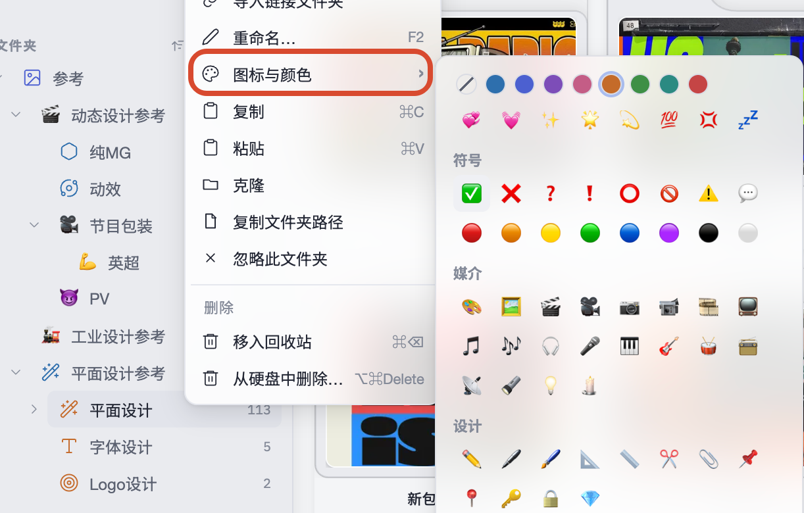

# 基本使用

## 创建、打开和设置资源库

首次启动时选择「创建资源库」，指定存放位置和显示名称即可。资源库目录包含托管资产、数据库和 `.serpent/` 工作目录；显示名称只影响 Serpent 中的显示，不会移动资源库目录。

之后可以从左上角「主菜单」→「资源库」创建、打开、导入或导出资源库。资源库菜单中的「资源库设置」可以修改名称、查看位置，并编辑当前库的忽略配置文件。简介字段目前尚未提供。

资源库设置的「忽略规则」使用 Git 风格的每行规则，文件名对用户显示为“忽略配置文件”，实际保存在资源库目录中。对资源库内的资产、文件夹或扩展名执行的忽略也会写入这里；保存后立即影响浏览、搜索和扫描：

```text
# 忽略所有 .tmp 文件
*.tmp
# 忽略该文件夹
参考/草稿/
# 保留某个文件
!参考/草稿/保留.png
# 隐藏所有名称以“.”开头的文件夹
.*/
```

问号帮助会说明 `*`、`?`、`**`、目录末尾 `/`、根目录开头 `/` 和 `!` 取消忽略规则。

### 打开外部资源库（Eagle / Billfish）

「打开资源库」→「打开外部资源库…」→ 选择 **Eagle** 或 **Billfish**：

1. 选择源库（Eagle/Billfish 的资源库目录或其归档压缩包）；
2. 选择 Serpent 的保存位置；
3. Serpent 会转换源库并在目标位置创建本地库（大型 Eagle 库首次转换可能需要数分钟）。

转换完成后，浏览、搜索、标签、AI 分析等体验与本地资源库一致，原库文件不会被改动。


## 导入资产

可以拖入单个文件、多个文件、多个文件夹或混合选择，也可以使用工具栏/主菜单中的「导入文件」「导入文件夹」。文件夹会递归扫描；浏览器扩展还支持把网页图片或视频右键保存、或直接拖拽保存。

当前产品注册的常用格式如下（实际解码仍可能受文件编码和源文件完整性影响）：

- 图像：PNG、JPG/JPEG、GIF、TIFF/TIF、WebP、SVG、BMP、ICO、PSD、EXR、TGA
- 相机 RAW：DNG、CR2、CR3、NEF、ARW、RAF、ORF、RW2
- 视频：MP4、MOV、AVI、WMV、WebM、MKV、M4V
- 音频：WAV、MP3、OGG/OGA、M4A、AAC、FLAC、Opus（生成波形封面并在查看器播放）
- 3D：FBX、OBJ、GLTF、GLB、STL（FBX 会先转换为可查看的 GLB）
- 文本：TXT、Markdown、JSON、CSV、XML、YAML、代码文件等常见文本格式

导入时文件会复制到资源库的资产目录并建立稳定资产 ID。同名或内容重复会打开冲突处理窗口。导入完成后缩略图、技术元数据和符合条件的 AI 分析在后台生成，不需要等待全部任务结束才能继续浏览。

#### 序列帧导入

在「设置」→「资产」中可以开启或关闭「导入时自动检测序列帧」（默认开启）。开启后，拖入或使用「导入文件」选择一组连续编号、尺寸一致的图片（如 `00001.png`…`00150.png`）时，Serpent 会识别为序列并弹出序列导入对话框，可设置 FPS；关闭后会按普通图片导入。导入后作为一套可播放的资产在查看器中播放，也可以「解散」回单帧。


在序列帧导入窗口中，可以调整帧范围和 FPS，然后选择只导入当前文件，或将所选帧作为序列导入。

## 工作区多标签页

Serpent 顶部支持多标签页并行浏览：


- **新建与切换**：点击标签栏右侧「+」或使用快捷键 `⌘T`（macOS）/ `Ctrl+T`（Windows）新建标签页。每个标签页独立维护浏览位置、搜索过滤条件、选择项与滚动视口。
- **路径提示**：鼠标悬停在文件夹标签页上时，会浮现该文件夹在资源库中的完整相对路径（链接文件夹展示磁盘实际路径），便于快速区分同名层级。
- **右键菜单**：右键标签页可执行「在侧栏中定位」（展开并高亮对应侧栏项）、「复制路径」「在访达 / 文件资源管理器中打开」「关闭标签页」或「关闭其他标签页」。
- **关闭与快捷键**：使用快捷键 `⌘W` / `Ctrl+W` 或点击标签上的 `×` 关闭。当只有一个标签页时，关闭按钮和关闭菜单自动停用。
- **重启恢复**：退出并重新打开应用后，会自动恢复各资源库上一次关闭时的标签页集合、排列顺序与活动页面。

## 文件夹与合集自定义外观（图标与颜色）

支持为资源库文件夹、链接文件夹根、合集和智能合集自定义图标与颜色标记：



- **设置与清除**：在侧栏或标签页右键点击目标，选择「图标与颜色...」，即可在弹出面板中挑选 Emoji、矢量装饰图标和主题配色；点击「恢复默认」可还原系统预设。
- **联动呈现**：设置后的图标和颜色会同步显示在左侧导航栏、顶部标签页以及资产右键菜单的移动/添加列表中。
- **链接文件夹标识**：链接文件夹根目录设置自定义图标后，角标仍会保留链接与离线状态标记；其内部扫描出的子目录不支持自定义外观。
- **数据安全**：外观仅作为资源库内部元数据保存，不会重命名或移动磁盘上的真实文件夹。

## 浏览和组织

- **左侧导航**：包含所有资产、回收站、文件夹、合集与智能合集。点击或拖拽至左栏空白处可回到根目录；支持在托管文件夹右键菜单中导入链接文件夹。
- **中部画布**：支持平铺与瀑布流布局；顶部工具栏可切换视图并勾选卡片信息字段（文件名、大小、日期、分辨率等）。
- **悬停预览**：光标移动到视频或音频卡片上时，可横向滑动进度条快速跳转预览。
- **顶部工具栏**：提供搜索框、高级过滤、排序维度与视图切换。
- **右侧 Inspector**：显示当前选中项的基础信息、标签、评分、喜欢状态、描述、来源链接、技术元数据与 AI 识别结果。

支持框选、`⌘`/`Ctrl` 点选与 `Shift` 范围选择；支持 `F2` 原地重命名。


## 查看器

双击资产打开全屏查看器（按 `Esc` 退出）：

- **导航切换**：使用方向键 `←` / `→` 在同组资产间快速前后切换。
- **媒体操作**：
  - 视频与音频打开后自动播放；
  - 3D 模型支持通过鼠标拖拽旋转、缩放与环境光切换；
  - 工具栏提供顺时针旋转 90°、水平/垂直镜像、适应窗口（小键盘 `.`）和全屏切换。


## 标签、合集和智能合集

- **标签**：可在 Inspector 或资产右键菜单中添加，支持多选资产批量设置；可在搜索框或高级过滤面板中按标签筛选。
- **合集**：用于跨目录归类资产（同一资产可加入多个合集）；从合集中移除资产或删除合集不会删除实际文件。打开父合集时可切换是否汇总子合集的资产。
- **智能合集**：保存特定的搜索与过滤规则，打开时自动呈现匹配资产；支持右键编辑规则。

## 回收站与删除

普通 `Delete`/macOS `⌘⌫` 将资产或文件夹移入回收站，可以恢复；Windows `Shift+Delete`、macOS `⌥⌘Delete` 从硬盘删除，执行前会显示确认。通知中的回撤图标可以撤回最近一次可撤销文件操作，恢复后当前视图会刷新。

## 链接文件夹

「文件」菜单中的「导入链接文件夹」可以引用资源库目录之外的文件夹（如项目或素材目录）。资产不会被复制进资源库，而是原位引用原文件夹中的文件；你可以稍后把链接文件夹复制进库内（转为托管）、重新链接（relink）或设置规则。

## WebDAV 云同步

Serpent 支持通过 WebDAV 在多台电脑之间同步资源库：全局配置服务器、每个资源库绑定、自动同步与轮询间隔、打开远端同步库。详见《[同步与外部资源库](sync.md)》。

## 快捷键

| 操作 | macOS | Windows |
| --- | --- | --- |
| 切换应用窗口全屏 | ⌃⌘F | F11 |
| 新建工作区标签页 | ⌘T | Ctrl+T |
| 关闭当前标签页 | ⌘W | Ctrl+W |
| 打开查看器 | Enter / 空格 | Enter / 空格 |
| 退出查看器返回浏览 | Esc | Esc |
| 外部应用打开 | ⌘O | Ctrl+O |
| 在文件管理器中显示 | ⌘⇧S | Ctrl+Shift+S |
| 聚焦搜索 | ⌘F | Ctrl+F |
| 重命名 | F2 | F2 |
| 移入回收站 | ⌘⌫ | Delete |
| 从硬盘删除 | ⌥⌘Delete | Shift+Delete |
| 复制 / 粘贴 | ⌘C / ⌘V | Ctrl+C / Ctrl+V |
| 查看器居中适配 | 小键盘 `.` | 小键盘 `.` |

更多搜索和过滤用法见[搜索与过滤](search-and-filters.md)，AI 设置和队列见[AI 分析](ai.md)。
